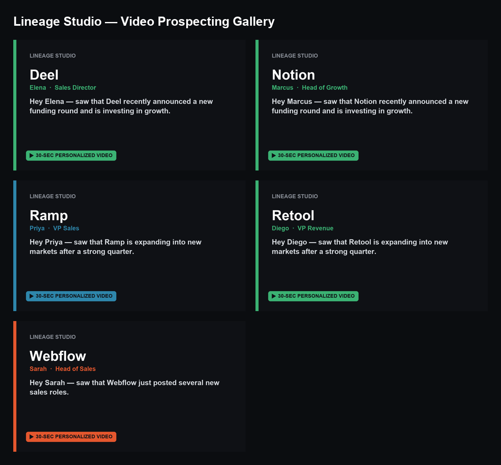
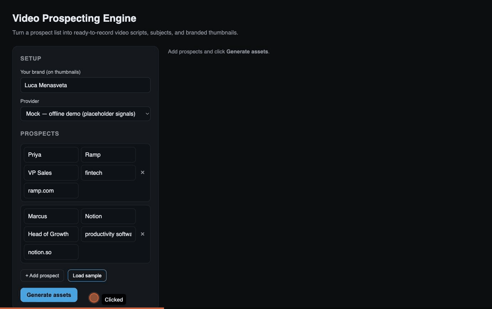

# Video Prospecting Engine

[](https://github.com/lucamenasveta/video-prospecting-engine/actions/workflows/ci.yml)

Turn a raw prospect CSV into **ready-to-record personalized video prospecting assets**.

For each prospect the tool:

1. **Finds one real, recent, cited buying signal** (hiring push, funding, launch, exec hire…) via Claude + web search.
2. **Writes a ~30-second video script** around it: hook → bridge → value → soft CTA.
3. **Drafts an email subject line.**
4. **Renders a branded 1280×720 thumbnail.**

Outputs a `scripts.md`, a `results.csv`, and a browsable `gallery.html`.

Built by a video producer moving into an SDR/BDR role — it's the proof-of-work: research → message → asset, at volume, the way a rep actually preps outreach.



*`gallery.html` — one branded, ready-to-record asset per prospect (mock provider shown).*

## Providers

| Provider | What it does | Needs |
|---|---|---|
| `mock` (default) | Fully offline. Synthesizes an **obviously-fake placeholder** signal so you can demo the whole pipeline with no API key. | nothing |
| `anthropic` | Uses Claude + the `web_search` tool to find a **genuine, cited** signal and write the script around it. | `ANTHROPIC_API_KEY`, `anthropic` package |

## Quick start

```bash
python3 -m venv .venv
source .venv/bin/activate
pip install -r requirements.txt

# Offline demo over the sample CSV:
python video_prospector.py prospects.csv --brand "Lineage Studio"

# Real, web-sourced signals (needs ANTHROPIC_API_KEY):
export ANTHROPIC_API_KEY=sk-ant-...
python video_prospector.py prospects.csv --provider anthropic --brand "Lineage Studio"
```

Open `output/gallery.html` in a browser to see the thumbnails and scripts.

## Web UI (no command line)

Prefer clicking to typing? Run the built-in web app and use it from a browser —
add prospects in a form, pick a provider, hit **Generate**, and get the gallery
plus a one-click **Download all (.zip)** of every script, thumbnail, and
teleprompter.



```bash
python app.py           # then open http://localhost:8000
```

It's standard-library only (no extra dependencies). In the UI, mock mode runs
instantly; for real signals choose **Anthropic** and paste your Claude API key —
it's used only for that request and never stored or logged.

## Example run

```text
$ python video_prospector.py prospects.csv --brand "Lineage Studio"
[1/5] Ramp …
[2/5] Notion …
[3/5] Deel …
[4/5] Retool …
[5/5] Webflow …

Done — 5 succeeded, 0 failed. Outputs in output/
  - output/scripts.md
  - output/results.csv
  - output/gallery.html
```

One generated asset (from `output/scripts.md`):

```markdown
## Ramp — Priya
*VP Sales*

**Buying signal:** Ramp is expanding into new markets after a strong quarter.
**Email subject:** quick idea for Ramp (made you a 30-sec video)

**Script (~30s):**
- **Hook:** Hey Priya — saw that Ramp is expanding into new markets after a strong quarter.
- **Bridge:** When teams at companies like Ramp scale outbound, the first thing that breaks is personalization at volume.
- **Value:** That's exactly what I fix — I build short, personalized prospecting videos your reps can send to book more first meetings. One rep I worked with doubled reply rates in three weeks.
- **CTA:** Worth a quick look? I made this whole video for Ramp in under two minutes — happy to show you how.
```

The matching `output/teleprompters/ramp.txt` holds just those four beats as one
clean paragraph — ready to read straight off camera.

Preview the plan first, without spending any tokens:

```bash
python video_prospector.py prospects.csv --provider anthropic --dry-run
```

## Input format

A CSV with these columns (extra columns are ignored):

```csv
first_name,company,role,industry,website
Priya,Ramp,VP Sales,fintech,ramp.com
```

Only `company` is required; missing `first_name` falls back to "there".

## Options

| Flag | Default | Meaning |
|---|---|---|
| `--provider` | `mock` | `mock` or `anthropic` |
| `--model` | `claude-opus-5` | Claude model id (anthropic provider) |
| `--brand` | `Your Studio` | Brand shown on thumbnails and the gallery |
| `--output-dir` | `output` | Where outputs are written |
| `--limit N` | `0` (all) | Only process the first N prospects |
| `--dry-run` | off | Print what would happen (no API calls, no files written) |

## Outputs

```
output/
├── scripts.md        one section per prospect (signal, subject, script)
├── results.csv       one row per prospect (machine-readable)
├── gallery.html      thumbnails + scripts in a grid
├── thumbnails/*.png  branded 1280×720 images
└── teleprompters/*.txt  clean spoken script per prospect, ready to read on camera
```

`output/` and `.env` are gitignored.

## License

MIT — see [LICENSE](LICENSE).

## Tests

```bash
pip install -r requirements-dev.txt
pytest
```

Covers the CSV loader (parsing, header/whitespace normalization, skipping rows
without a company) and the offline mock provider (output shape, determinism,
and that the placeholder signal is never presented as a real citation).
